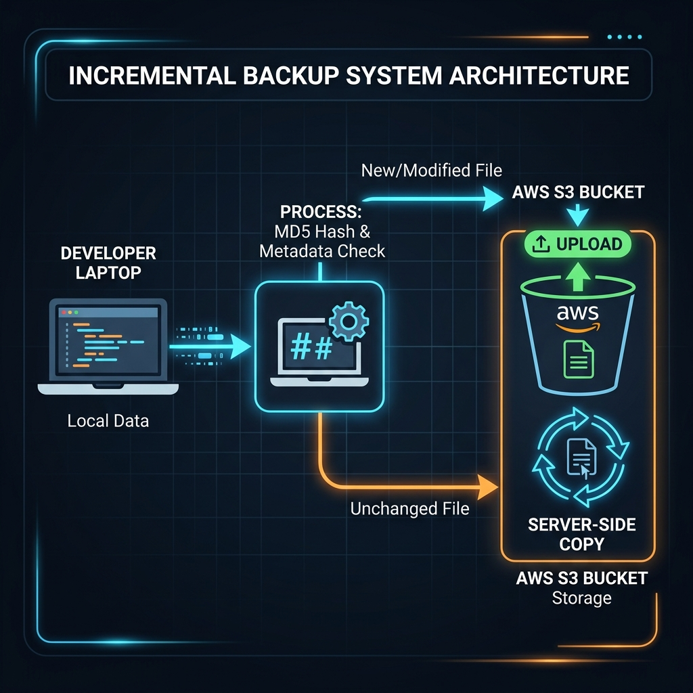

<div align="center">
  
# ☁️ S3 Backup Tool
  
**A production-grade, CLI-based incremental backup utility built with Python and AWS `boto3`.**

[](https://python.org)
[](https://aws.amazon.com/sdk-for-python/)
[](https://opensource.org/licenses/MIT)
[]()

This tool provides a robust, scalable way to backup local directories to AWS S3 using timestamped versioning. It automatically handles intelligent incremental backups (saving bandwidth by copying unchanged files server-side), enforces secure encryption, and configures automated S3 lifecycle transitions.

<br/>



</div>

---

## ✨ Key Features

- 🚀 **Intelligent Incremental Backups**: Calculates local file MD5s and compares them against custom S3 metadata (`x-amz-meta-file-md5`) to accurately detect changes. If a file hasn't changed, it uses S3's lightning-fast server-side `copy_object` to duplicate it into the new timestamp prefix without re-uploading from your local machine.
- 🕒 **Timestamp-Based Isolation**: Every backup run is safely stored in a clean `YYYY-MM-DD_HH-MM-SS/` isolated prefix.
- 🛡️ **Enterprise Security**: Defaults to `AES256` Server-Side Encryption (SSE-S3), with optional native support for AWS KMS (`aws:kms`).
- 🔄 **Lifecycle Automation**: Automatically transitions older backups to cheaper storage (Standard-IA after 30 days, Glacier after 90 days, and deletion after 365 days).
- 📡 **Rock-Solid Reliability**: Built-in exponential backoff and explicit retry wrappers seamlessly handle intermittent network blips.
- 🧪 **Dry-Run Mode**: Safely preview which files will be uploaded and which will be skipped before making any API calls using `--dry-run`.
- 📊 **Robust Logging**: Outputs detailed operation logs to the console and natively appends to `logs/s3_backup.log`.

---

## 🏗️ Project Architecture

```text
s3-backup-tool/
│
├── config.py             # Flexible config loading (CLI args > .env > Defaults)
├── file_utils.py         # Local file operations, MD5 chunking, and path normalization
├── s3_utils.py           # Core AWS interactions (boto3, pagination, metadata, lifecycle)
├── s3_tool.py            # Main CLI entry point (argparse, logging setup, tool orchestration)
├── requirements.txt      # Python dependencies
└── README.md             # Project documentation
```

---

## 🧠 Technical Deep-Dive

### 🛑 The Problem: ETag Limitations
A naive approach to S3 incremental backups compares the local file's MD5 hash against the S3 Object's `ETag`. While this works for small files, it **completely fails for large files uploaded via S3 Multipart Upload**. 

Multipart ETags are computed using a "hash of hashes" ending in a dash and a part count (e.g., `c9a5a...f034-2`), meaning they cannot be compared directly against a standard local MD5.

### ✅ Our Solution: Metadata Injection
This tool explicitly calculates the local MD5 and injects it into the object's metadata under the custom key `x-amz-meta-file-md5` upon upload. During subsequent backups, it fetches this metadata, ensuring **100% reliable change-detection regardless of the upload method or file size**.

---

## 🚀 Getting Started

### 1️⃣ Installation

Clone the repository and install the required dependencies.

```bash
git clone https://github.com/kevinjosh10/s3-backup-tool.git
cd s3-backup-tool

# Optional: Create a virtual environment
python -m venv venv
source venv/bin/activate  # On Windows use `venv\Scripts\activate`

# Install requirements
pip install -r requirements.txt
```

### 2️⃣ Configuration

Set up your AWS credentials. You can use standard `~/.aws/credentials`, environment variables, or a local `.env` file.

Create a `.env` file in the root directory:
```env
S3_BUCKET_NAME=my-production-backup-bucket
AWS_REGION=us-west-2
# Optional: KMS_KEY_ID=arn:aws:kms:...
```

---

## 📘 Usage Examples

### 📤 Uploading a Backup
Recursively scans a directory, applies MD5 metadata, and performs an incremental upload.

```bash
# Dry run to preview what will happen safely
python s3_tool.py upload --dir ./my_important_data --dry-run

# Actual production upload
python s3_tool.py upload --dir ./my_important_data

# Override bucket or region dynamically via CLI
python s3_tool.py upload --dir ./my_important_data --bucket override-bucket --region eu-central-1
```

### 📥 Restoring a Backup
Downloads a specific backup using S3 Pagination (fully supporting directories with >1000 files).

```bash
python s3_tool.py download --backup 2023-10-15_14-30-00 --dir ./restored_data
```

### ⚙️ Managing Lifecycle Policies
Applies the pre-configured data retention and cost-optimization lifecycle rules to your bucket.

```bash
python s3_tool.py lifecycle
```

---

## 🔮 Limitations & Future Improvements

While this is a robust production-grade utility, there are always areas for evolution:

* **Parallel Processing**: Uploads and server-side copies are currently executed sequentially. Integrating `concurrent.futures` could vastly improve performance for directories with thousands of small files.
* **Empty Directory Handling**: S3 is a flat object store; it does not natively support empty directories. Currently, empty local directories are safely skipped and not recreated on restore. Future versions could upload `0-byte` placeholder objects to preserve them.
* **Large File Verification**: Calculating the MD5 hash for massive files (>50GB) locally before upload can be time-consuming. Future iterations could allow opting out of MD5 checks for files exceeding a specific threshold, relying instead on modified timestamps.

---
<div align="center">
  <i>Built with ❤️ by Kevin Josh</i>
</div>
